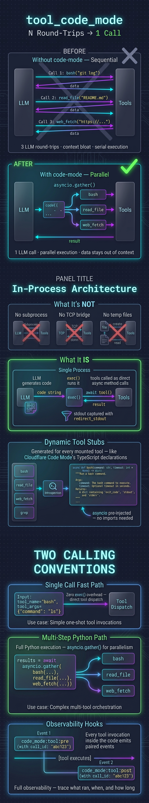

# amplifier-code-mode

Adds a `tool_code_mode` tool to any Amplifier session. Instead of making N sequential tool
calls — each one burning a full LLM round-trip — the LLM writes a single Python async code
block. All session tools are injected into the execution namespace as async functions. Results
are printed to stdout and returned as one response.

Based on [Cloudflare's Code Mode](https://blog.cloudflare.com/code-mode/).



---

## The problem it solves

Without `tool_code_mode`, multi-step work looks like this:

```
LLM → bash("git log --oneline -20")  →  result to LLM context
LLM → read_file("src/auth.py")        →  result to LLM context
LLM → web_fetch("https://docs...")    →  result to LLM context
LLM → synthesize all three            →  final answer
```

That's 3 round-trips, 3 chunks of intermediate data stuffed into context, and 3× the latency.

With `tool_code_mode`, one call does all three **in parallel**:

```python
log, src, docs = await asyncio.gather(
    bash(command="git log --oneline -20"),
    read_file(file_path="src/auth.py"),
    web_fetch(url="https://docs..."),
)
print(f"Log: {log['stdout']}")
print(f"Source: {src['content'][:500]}")
print(f"Docs: {docs['content'][:1000]}")
```

One LLM call. Parallel execution. Intermediate data never touches the context window.

---

## How it works

### Dynamic tool description

Every time the LLM sees the `tool_code_mode` schema, the description field is regenerated to
include Python async function stubs for **every tool currently mounted in the session**:

```python
async def bash(
    command: str,
    timeout: int = None,
    run_in_background: bool = None,
) -> dict:
    """
    Execute a bash command.
    command: The shell command to run.
    Returns: dict — keys: 'stdout', 'stderr', 'returncode'
    """
    ...

async def read_file(
    file_path: str,
    offset: int = None,
    limit: int = None,
) -> dict:
    """
    Read a file from the filesystem.
    file_path: Absolute or relative path.
    Returns: dict — keys: 'content', 'total_lines', 'file_path'
    """
    ...
```

Required parameters come first (no default). Optional parameters have `= None`. Enum parameters
become `Literal["a", "b", "c"]`. The LLM gets precise API surface before writing any code —
analogous to how Cloudflare Code Mode injects TypeScript declarations into the system prompt.

### In-process execution

There is no subprocess. No TCP bridge. No temp files.

When the LLM submits code, `tool_code_mode`:

1. Wraps it in `async def _tool_code_mode_main()`
2. Compiles with `compile(..., "<tool_code_mode>", "exec")`
3. Injects `asyncio` + per-tool async wrappers into the exec namespace
4. Runs under `asyncio.wait_for` with a configurable timeout
5. Captures stdout with `redirect_stdout`
6. Returns the captured output as the tool result

Each `await tool_name(...)` call inside the code goes directly to `tool_obj.execute(kwargs)` —
a real in-process method call, not a network hop.

### Observability

Every tool invocation inside the code emits paired hook events:

```
code_mode:tool:pre   → {call_id, tool_name, tool_input}
code_mode:tool:post  → {call_id, tool_name, tool_input, tool_result}
```

`call_id` is a UUID that pairs every pre with its post. Hooks receive these under the
`code_mode:tool:*` namespace so they don't collide with the orchestrator's LLM-dispatched
tool call tracking.

---

## Two calling conventions

`tool_code_mode` supports two ways to call it, depending on the task:

### Single tool call — fast path

For a single operation, skip the Python exec entirely:

```json
{
  "tool_name": "bash",
  "tool_args": { "command": "ls -la" }
}
```

The tool is called directly. Zero Python compilation overhead. Same hook events fire.
Exactly equivalent to calling `bash` directly, except it works when code-mode enforcement
blocks all other top-level tools (see [L2 mode](#l2-mode-enforcement) below).

### Multi-step — Python execution path

For 2 or more operations, write Python:

```json
{
  "code": "a, b = await asyncio.gather(\n    read_file(file_path='README.md'),\n    bash(command='git log --oneline -5'),\n)\nprint(a['content'][:200])\nprint(b['stdout'])"
}
```

`asyncio` is pre-injected — no imports needed. All mounted tools are in scope as awaitable
async functions. Use `print()` to return results; the captured stdout is the tool output.

---

## Installation

### One-liner: add to your app bundle

Installs globally for all your Amplifier sessions:

```bash
amplifier bundle add git+https://github.com/kenotron-ms/amplifier-code-mode@main --app
```

### Project mode

Installs for the current project only (adds to `.amplifier/`):

```bash
amplifier bundle add git+https://github.com/kenotron-ms/amplifier-code-mode@main
```

### Include in your own `bundle.md`

If you're authoring an Amplifier bundle and want `tool_code_mode` as part of it, add it under
`includes:`:

```yaml
---
bundle:
  name: my-bundle
  version: 1.0.0

includes:
  - bundle: git+https://github.com/microsoft/amplifier-foundation@main
  - bundle: git+https://github.com/kenotron-ms/amplifier-code-mode@main

# ... rest of your bundle config
---
```

Or if you only want the tool module itself (without the bundle's context and agents):

```yaml
---
bundle:
  name: my-bundle
  version: 1.0.0

includes:
  - bundle: git+https://github.com/microsoft/amplifier-foundation@main

tools:
  - module: tool-code-mode
    source: git+https://github.com/kenotron-ms/amplifier-code-mode@main#subdirectory=modules/tool-code-mode
    config:
      timeout: 60    # Python execution timeout in seconds (default: 60)
---
```

---

## Behaviors

This bundle ships two composable behaviors for different levels of commitment.

### `code-mode` — suggested use

The tool is available and the LLM is strongly encouraged to use it for multi-step work.
The LLM can still call other tools directly if it wants to. Best for most users.

```yaml
includes:
  - behavior: git+https://github.com/kenotron-ms/amplifier-code-mode@main#behaviors/code-mode.yaml
```

### `code-mode-always` — mandate

The LLM is told that `tool_code_mode` is the **primary interface** for all tool interaction.
Not a soft suggestion — the context mandates it. Activate `/code-mode` to also add hard
tool-level enforcement (see below). Best for teams who want consistent code-first patterns
across all sessions.

```yaml
includes:
  - behavior: git+https://github.com/kenotron-ms/amplifier-code-mode@main#behaviors/code-mode-always.yaml
```

---

## L2 mode: enforcement

Type `/code-mode` in any session that has this bundle installed to engage enforcement mode.

When active:
- All tools **except** `tool_code_mode` are blocked at the execution layer
- The LLM has no choice but to route all tool work through `tool_code_mode`
- The single-call fast path (`tool_name` + `tool_args`) is still available for trivial ops
- Type `/code-mode` again to deactivate

This is L2 in the three-level model:

| Level | What it does | How |
|-------|-------------|-----|
| L1 | Strongly suggests `tool_code_mode` for multi-step work | Tool description + context instructions |
| L2 | Locks all tool calls through `tool_code_mode` | `/code-mode` mode — blocks other tools at execution layer |
| L3 | *(coming)* Always-on orchestrator-level enforcement | `loop-code` orchestrator (no tool call syntax at all) |

---

## Configuration

```yaml
tools:
  - module: tool-code-mode
    source: ...
    config:
      timeout: 60    # seconds before execution is killed (default: 60)
```

---

## What runs inside the code

Inside the Python code, you have access to:

- **All mounted session tools** — as `async def` functions, already in scope, just `await` them
- **`asyncio`** — pre-injected, use `asyncio.gather()` directly without importing
- **The full Python standard library** — `json`, `os`, `re`, `pathlib`, `datetime`, etc.

Tools return dicts. Access values with `result['key']`. If you're not sure what keys a tool
returns, do `print(list(result.keys()))` first.

```python
# Example: gather data from three sources in parallel, process, print summary
import re  # stdlib imports work too

git_log, readme, package = await asyncio.gather(
    bash(command="git log --oneline -10"),
    read_file(file_path="README.md"),
    read_file(file_path="pyproject.toml"),
)

commits = git_log['stdout'].strip().splitlines()
version_match = re.search(r'version = "(.+?)"', package['content'])
version = version_match.group(1) if version_match else "unknown"

print(f"Version: {version}")
print(f"Last {len(commits)} commits:")
for c in commits:
    print(f"  {c}")
print(f"\nREADME length: {package['total_lines']} lines")
```

---

## Repository

```
amplifier-code-mode/
├── bundle.md                          # distributable bundle
├── behaviors/
│   ├── code-mode.yaml                 # composable: suggest usage
│   └── code-mode-always.yaml          # composable: mandate usage
├── context/
│   └── instructions.md                # LLM guide injected at session start
├── agents/
│   └── code-executor.md               # specialist agent for delegation
├── modes/
│   └── code-mode.md                   # /code-mode enforcement mode
└── modules/
    └── tool-code-mode/                # the tool module
        ├── amplifier_module_tool_code_mode/__init__.py
        └── tests/test_mount.py        # 42 tests
```
